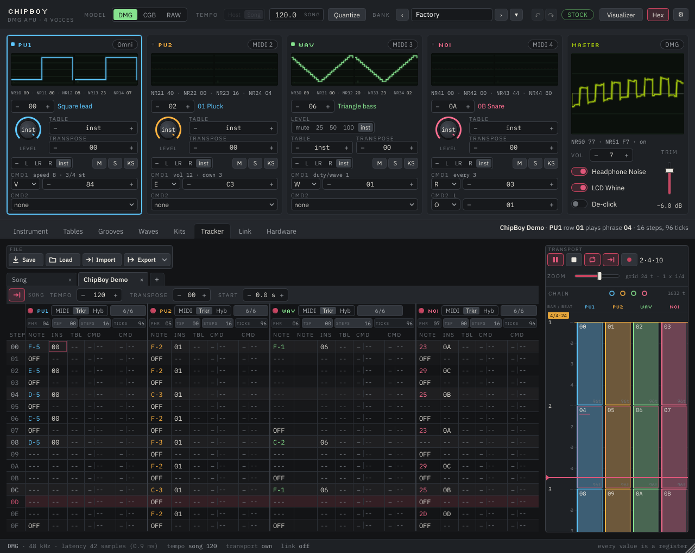

# ChipBoy — Game Boy DMG sound chip instrument

ChipBoy is a **Game Boy sound chip**, not a chiptune synth. Every sound it makes is
one an original DMG could make, produced by the same mechanism: a cycle-accurate
emulation of the four APU channels feeding a model of the DMG's analog output stage —
the 4-bit DACs, the shared summing amp, and the coupling capacitor that puts the
droop on every square wave and the click on every note.

The restrictions are the product. Four monophonic voices. Volume in sixteen steps with
eight envelope rates. Pitch as an 11-bit period, out of tune at the top of the range.
Panning that is left, right, both, or off. There is no fine gain control inside the
chip, because there isn't one in the chip.

Sound design follows LSDj's vocabulary — instruments, tables, waves and frames, kits —
with values shown in base 10 instead of hex, and the same hardware constraints behind
them.


## Two plugins

| | |
|---|---|
| **ChipBoy** | The chip. One instance is one complete DMG APU: four channels, stereo out, and a **tab per open song** — each with its own instrument bank, only the active one live. Plays MIDI directly if it is the only thing loaded. |
| **ChipBoy Voice** | A control surface for one channel, on its own DAW track. Produces no audio; sends notes and parameters to a linked ChipBoy instance so each channel gets its own piano roll and its own automation lanes. |

Four voices per instance, always. If you want more, load another instance.

## Status

**v1 is built.** Everything the workshop decided ships: the cycle-exact APU with the
DMG and CGB chip variants, the measured analog stage with a RAW bypass, the LSDj-shaped
bank (instruments, tables, waves and frames, kits), a driver with its own tick, a
tracker with song tabs — each song owning its own bank — that follows the host
transport or runs its own, records, and saves songs and instrument presets to their own
files, two plugins linked through shared memory, the Hardware panel's options, and the
window from the mockup with its visualizer and period-locked scopes. It has
been compiled and tested on Linux (61 core tests, the link integration test, VST3 and
Standalone builds). The Windows and macOS builds are made by hand from the same tree
(the build section below); CI builds them only when asked
(Actions → CI → Run workflow) or for a `v*` tag, since the local Linux gate runs
before every push.

**Revised on 2026-09-07:** the channel is now a visible tracker row — an instrument, a
table and two command slots — instead of a row of lanes that silently overrode the
instrument, and the driver's tick is fixed at 24 to the beat with one switch for whose
beat it is, the host's or the song's. The design is
[`docs/COMMANDS_AND_TEMPO.md`](docs/COMMANDS_AND_TEMPO.md) and it supersedes the spec
where they differ; projects and banks from before it are not migrated.

Expect first-run bugs; the documents remain the source of truth:

- [`docs/CHIPBOY_SPEC.md`](docs/CHIPBOY_SPEC.md) — the build specification, and the source of truth.
- [`docs/COMMANDS_AND_TEMPO.md`](docs/COMMANDS_AND_TEMPO.md) — commands, the channel's lanes and the tempo model; supersedes the spec where they differ.
- [`docs/UI_DESIGN.md`](docs/UI_DESIGN.md) — the interface, its reasons, and the decisions taken.
- [`docs/HARDWARE_REFERENCE.md`](docs/HARDWARE_REFERENCE.md) — DMG APU registers, timing, and the measured analog behaviour the emulation has to reproduce.
- [`docs/LICENSING.md`](docs/LICENSING.md) — third-party obligations and the licence decision still to be made.
- [`docs/CAPTURE_GUIDE.md`](docs/CAPTURE_GUIDE.md) — step-by-step procedure for measuring a real DMG and CGB.
- [`CHANGES.md`](CHANGES.md) — every departure from the spec, with reasons, and what is deferred.
- [`Demo/`](Demo/) — a Reaper project and a MIDI file that play a short tune through all four channels, a Hybrid project on the same tune, and six original songs written straight into the tracker.

Open decisions are collected in spec §18 and marked `[DECIDE]` throughout.

## Building the plugins

Requirements: CMake 3.24+, a C++20 compiler (Visual Studio 2022 on Windows, Xcode 15+ on
macOS, GCC 13 / Clang 16 on Linux) and git. The first configure fetches JUCE 8.0.15
from GitHub, so it needs the network once.

**Windows** (a Developer Command Prompt or PowerShell):

```
git clone https://github.com/JoeDobro93/ChipBoy.git
cd ChipBoy
cmake -S . -B build -DCHIPBOY_BUILD_PLUGIN=ON -DCHIPBOY_BUILD_TESTS=OFF
cmake --build build --config Release --target ChipBoy_VST3 ChipBoyVoice_VST3 ChipBoy_Standalone
```

The outputs:

| Target | Path |
|---|---|
| ChipBoy VST3 | `build\ChipBoy_artefacts\Release\VST3\ChipBoy.vst3` |
| ChipBoy Voice VST3 | `build\ChipBoyVoice_artefacts\Release\VST3\ChipBoy Voice.vst3` |
| Standalone | `build\ChipBoy_artefacts\Release\Standalone\ChipBoy.exe` |

Copy the two `.vst3` folders into `C:\Program Files\Common Files\VST3\` and rescan in
the DAW (FL Studio: Options → Manage plugins → Find plugins; Reaper: Preferences →
Plug-ins → VST → Re-scan). Configuring with `-DCHIPBOY_COPY_PLUGINS=ON` copies them
after every build instead, which on Windows needs a prompt with write access to that
folder. Visual Studio is a multi-configuration generator: always pass `--config Release`
to the build command, or you get a slow Debug build in `build\...\Debug\`.

**macOS**:

```
cmake -S . -B build -DCHIPBOY_BUILD_PLUGIN=ON -DCHIPBOY_BUILD_TESTS=OFF
cmake --build build --config Release --target ChipBoy_VST3 ChipBoy_AU ChipBoyVoice_VST3 ChipBoyVoice_AU ChipBoy_Standalone
```

Outputs land in the same `*_artefacts/Release/` folders; VST3s go to
`~/Library/Audio/Plug-Ins/VST3`, components to `~/Library/Audio/Plug-Ins/Components`
(`-DCHIPBOY_COPY_PLUGINS=ON` does this). The build signs ad hoc; Logic may need
`killall -9 AudioComponentRegistrar` and a restart to see a new component.

**Linux**: install `libasound2-dev libfreetype6-dev libfontconfig1-dev libx11-dev
libxrandr-dev libxinerama-dev libxcursor-dev libxext-dev libgl1-mesa-dev
libcurl4-openssl-dev`, then the same commands; the VST3 goes to `~/.vst3`.

Three console tools come with the plugin build: `chipboy_paramdump` prints the
host-visible parameter list in index order (the demo generator checks itself against
it); `chipboy_linktest` runs both plugins in one process through a link region and
checks the whole path (`ctest --test-dir build -C Release -R linktest`); and
`chipboy_recordtest` plays the demo song through the processor twice — once recording a
Trkr performance, once replaying the song that recording produced — and fails on the
first APU register write the two passes disagree on
(`ctest --test-dir build -C Release -R recordtest`). A third pass, `demo_song_matches`,
loads `Demo/ChipBoy Demo.cbsong` with no MIDI and no play head and checks it drives the
chip exactly as the recording did, and that recording the demo again reproduces the
file byte for byte (`ctest --test-dir build -C Release -R demo_song_matches`). The same
tool's `--check-state` compares the processor against the hybrid project's saved state,
`Demo/chipboy_demo_hybrid.state` (`demo_state_matches`), and its `--play-song FILE`
loads any of the six songs under `Demo/songs` and measures every channel, run over
every file by `demo_songs_load`.

## Playing it



1. Put **ChipBoy** on a track and play. PU1 answers every MIDI channel (omni); PU2, WAV
   and NOI answer MIDI channels 2, 3 and 4. Change any channel's source in its strip.
2. **Each channel's scope is period-locked** to two cycles of its own frequency
   register, on the edge its waveform's own shape names, so a sustained note holds
   still and vibrato breathes instead of sliding; noise and kits keep a fixed window.
   The **master strip** holds one **VOL** control (0–7, writing both NR50 sides as one
   move) and three switches — **Headphone Noise**, **LCD Whine** and **De-click** —
   plus the output trim.
3. **A channel is a tracker row**, and its automation lanes are that row: *Instrument*,
   *Table*, *Level*, *Pan*, *Transpose*, two **command slots**, *Live follow*,
   *Velocity* and *Keyswitches*. That is the whole list. The instrument holds the sound —
   there are no lanes quietly overriding its duty, envelope, sweep, wave, frame, vibrato,
   arpeggio or detune. Each note takes the values in force when it starts, or follows
   them live with *Live follow*. A note landing over one still held is legato when the
   instrument's **Overlap** field says so — it just bends to the new pitch, instead of
   retriggering the instrument (pulse and wave default to legato, noise and kits to
   retrig).
4. **The two command slots** are LSDj's letters with base-10 arguments: `W` duty on a
   pulse channel and the wave slot on WAV, `E` envelope, `V` vibrato, `A` table, `F`
   frame, `C` chord, `L` slide, `R` retrigger, `P` bend speed, `O` pan, `S` PU1's
   sweep, `K` kill, `D` delay, `M` master volume, `G` groove, `T` tempo, `Z` random. A
   slot is three parameters — the letter, `x` and `y` — and it is *in force*, not
   momentary: it fires at the next tick when one of the three changes, and again at every
   note-on after the instrument and its table. Put the letter back to *none* and what it
   changed reverts to the instrument's own value. The strip shows the meaning
   ("vol 12 · down 3"), never a packed byte, with the running state under it, so an
   automation move is visible as the slot changing and the state following. The
   instrument's own **Pitch speed** — Fast, Tick, Step or Drum — sets how `V`, `L` and
   `P` move: Fast is a tempo-independent 360 Hz, Tick follows the tempo, Step makes `P`
   an immediate jump instead of a bend, and Drum bends `P` and `L` in semitones, for a
   kick. A note-on in the **command octave** — MIDI notes 0–11, on any channel — never
   sounds: it fires CMD1 then CMD2 on whatever the channel is already playing, without a
   trigger, so a held note can be shaped after its attack from a keyboard with no wheel
   to spare.
5. Velocity sets the envelope's start volume — or selects an instrument, or is ignored,
   per channel — the mod wheel sets vibrato depth, and pitch bend moves the period.
6. **Tempo.** Ticks, which tables, vibrato, wave frames and tracker steps all run on, are
   always 24 to the beat. *Tempo source* (in the header bar) chooses whose beat:
   **Host**, the default, where a tick sits at every multiple of 1/24 of the host's beat
   and scrubbing is exact; or **Song**, where the plugin keeps its own *Song tempo*
   (40–255 BPM, automatable) with `T` commands over it. The header's tempo field is a
   **read-only readout** of whichever is in force — each song's own master tempo is
   typed in the Tracker tab instead. Either way **the host's time signature never
   reaches the tracker**: only its tempo does, and a song's bar is always its own
   *Beats* per bar, so the host's bars stay a ruler in both modes. *Quantize* (default
   off) holds note-ons and note-offs until the next tick, for the tracker's feel; bends
   and controllers are never quantised, and tracker cells are always on ticks.
7. For one track per voice: put a **ChipBoy Voice** on another track, turn **Link mode**
   on in ChipBoy's Link tab (the host re-compensates for one block of latency), and
   pick the instance and channel in the Voice. The Voice's track stays silent; the audio
   comes out of the ChipBoy track. Its parameters are the same set, as automation lanes
   where you expect them.
8. **Keyswitches** (per channel, off by default): notes 24–35 on a pulse channel and
   12–23 on the wave and noise channels select instrument slots 1–12 without sounding.
9. Songs live in **tabs**: one per open song, plus a **+** tab that starts an empty one
   on the factory bank. Only the active tab plays and is edited, and it is what the
   Instrument, Tables, Grooves, Waves, Kits tabs and the header's Bank group show; a
   song file embeds its own bank, so **Load song…** brings its sounds with it. The
   **Tracker** tab (renamed from Phrases) is a tracker on that same clock: note,
   velocity, instrument, table and two commands per channel. *Steps / bar* is a typed
   number, 1–64, and a bar may take its own count instead, in the chain's **STP**
   column. A cell's two commands fire once, at their step: the persistent letters
   (`A E F G M O P S T V W`) hold until the next note that carries an instrument, same as
   a slot; the rest (`C D K L R Z`) shape only that note. Each lane carries a record
   **arm** and a **PLAYS** switch — **MIDI**, **Trkr**, or **Hybrid**, which takes notes
   from MIDI and everything else (instrument, table, commands) from the song's cells at
   their steps; with the head row's *Rec* on, an armed channel records what it plays
   whatever the switch says — an overdub onto a Trkr lane stays audible — and playing
   the song back in Trkr reproduces the performance, tempo and groove included. *Play*,
   *Stop* and *Loop* run the song on the plugin's own clock when nothing else offers a
   transport (the Standalone, chiefly), and mirror the host's transport, disabled, when
   one is playing. *Save song…* / *Load song…* write and read a `.cbsong`; it also names
   the bank it was written with and every instrument slot it uses, so loading it against
   a different bank reports where the two disagree.
10. The **Grooves** tab holds the song's sixteen editable grooves (groove 0 is straight)
    — sixteen tick counts each, for the swing and triplets a straight six ticks a step
    can't give — with the total against the bar's ticks, a swing readout and a ◀ ▶
    nudge. A phrase picks its groove from the chip in the Tracker tab's lane; tables run
    on one too.
11. Instruments save and load on their own: **Save preset…** / **Load preset…** in the
    Instrument tab write and read a `.cbi` — the instrument plus every table, wave and
    kit it depends on. Loading one drops each dependency into a free slot of its kind
    (or reuses an identical one already in the bank) and renumbers every reference to
    match.
12. The **Hardware** tab holds the model switch (DMG / CGB / RAW), the hardware states
    (headphone noise, LCD line, CGB bass mod, volume writes at edges) and the two
    departures (de-click, soften master pops), which light the MODIFIED badge.
13. **Typing, the wheel and undo.** Every number is typeable: click a stepper's readout
    or double-click a knob or the trim fader and a small box opens — Enter commits,
    Escape cancels, and what is not a number in the field's base is refused rather than
    guessed at, while a number outside the hardware's range is clamped to it. The mouse
    wheel never changes a value anywhere; it scrolls the pane, the list or the chain
    under it, so scrolling past a knob cannot retune an instrument. Everything done by
    hand undoes: **↶ ↷** in the header, **Ctrl+Z**, **Ctrl+Shift+Z** and **Ctrl+Y**,
    with the buttons naming what they would take back ("Undo: PU1 Instrument 3 → 5").
    Host automation and loading a project are not edits and never go on the history; a
    knob drag, a stepper held down and the digits of one typed value are each one step.
    In a command cell the letter and the values are separate: click the letter for a
    palette of the letters that channel can carry, then type the values; a right click
    on an **ins** or **tbl** cell lists the bank's slots by name.
14. `Demo/ChipBoy Demo.rpp` opens in Reaper with the tune and its automation, and
    `Demo/ChipBoy Demo (song tempo).rpp` runs the same track on the song's clock at 150
    BPM with a `T` that drops it to 100 for four bars; the tune alone is in
    `Demo/chipboy_demo.mid` for any other host, and the same tune recorded onto the
    tracker is `Demo/ChipBoy Demo.cbsong` (see `Demo/README.md`).
    `Demo/ChipBoy Demo (hybrid).rpp` plays that same MIDI item with the demo song loaded
    and all four channels on **Hybrid** instead of automation, and `Demo/songs/` holds
    six more original songs, each carrying its own bank, written straight into the
    tracker — no MIDI, no automation, no DAW required.

## Building the core and its tests

The emulation core has no dependency on JUCE and builds on its own. Test ROMs are
fetched at configure time into the git-ignored `TestRoms/`; SameSuite is assembled from
source if RGBDS is on the `PATH`, and skipped with a message otherwise.

```
cmake -S . -B build-core -DCMAKE_BUILD_TYPE=Release
cmake --build build-core --config Release --parallel
ctest --test-dir build-core -C Release --output-on-failure
```

`build-core/chipboy_runrom <rom.gb> [seconds]` runs one test ROM and prints what it
reports.

## Hearing it without a DAW

```
build-core/chipboy_demo tune.wav                 # a built-in tune, DMG, noise floor on
build-core/chipboy_demo tune.wav --cgb           # the same tune through the CGB analog constants
build-core/chipboy_demo tune.wav --no-noise      # Headphone Noise off
build-core/chipboy_runrom game.gb 20 --wav out.wav   # any ROM's audio, run headless
```

Output is 16-bit stereo at 48 kHz (`--rate` changes it). The tune ends every note the
way a DMG driver has to — by disabling the DAC — so what you hear at each re-trigger is
the hardware's own click, not an effect.

## Troubleshooting

- **The JUCE fetch fails** (a proxy, no network): clone JUCE 8.0.15 yourself and pass
  `-DFETCHCONTENT_SOURCE_DIR_JUCE=<path>` to the configure step.
- **The DAW does not find the plugin**: check the folder above, rescan, and on Windows
  make sure you built `Release` (the Debug build goes elsewhere).
- **A Voice shows "waiting" forever**: Link mode must be on in the ChipBoy instance, and
  both plugins must run as the same user. The link lives in the temp folder under
  `chipboy-link/`; after a host crash a stale `.cbl` file there can be deleted.
- **A Voice shows "channel busy"**: another Voice holds that channel; the first keeps it.
- **It pops when I change volume**: it is supposed to; turn on *Volume writes at edges*
  or, for a departure from the hardware, *De-click*.

## Planned targets

JUCE 8 / C++20 / CMake. VST3, AU (macOS) and Standalone on Windows 10+ x64 and
macOS 11+ (universal arm64 + x86_64). CLAP under consideration.

## License

Not yet chosen — see [`docs/LICENSING.md`](docs/LICENSING.md). The repository is
private and the code is written so that every option stays open: the emulation core
links no JUCE and no copyleft code, and nothing derived from LSDj enters the tree.
