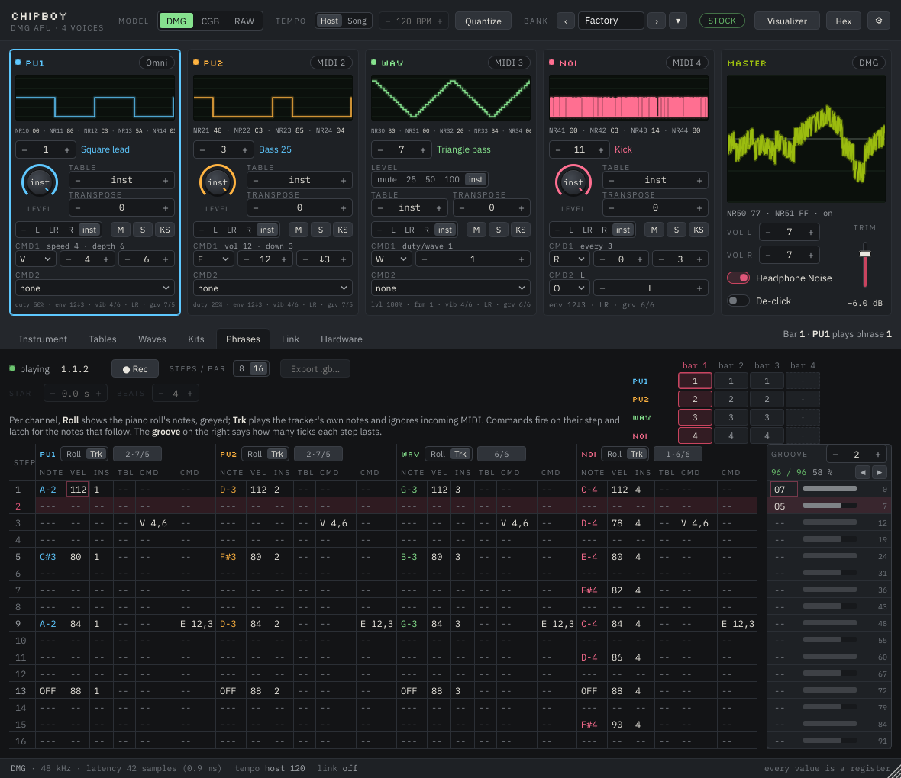

# ChipBoy — interface and feature design

Working document for the UI workshop. The spec (`CHIPBOY_SPEC.md` §11–§13) already fixes
the two-plugin architecture, the parameter rules and the bank; this document turns those
into screens, decides what the musician sees first, and records where the workshop
changes the spec. The interactive mockup is `docs/mockups/chipboy_mockup.html`.

Everything here follows one rule from the spec: **the chip is the instrument.** Every
control is a register or a driver choice, shown in the chip's own ranges, and the
interface's job is to make the constraints legible rather than to hide them.

---

## 1. Two plugins, one machine

**ChipBoy** is the machine: the APU, the bank, the analog stage, the stereo output. One
instance is one Game Boy — four mono voices that share a mixer, one coupling capacitor
per side, and the wave channel's rules (C1, C9).

**ChipBoy Voice** is a remote control for one of those four voices, living on its own
track so it gets its own piano roll, automation lanes, name and colour. It is an
instrument that outputs silence and says so (spec §11.6).

Each of the four hardware channels has a **source**:

| Source | What it means | When to use it |
|---|---|---|
| **MIDI channel 1–16** on the ChipBoy track | Notes on that MIDI channel play this voice | One track drives the whole machine: FL's per-pattern MIDI channel, Reaper's item channel, Logic's multi-timbral tracks |
| **Omni** | Every note reaching the ChipBoy track plays this voice | The first minute: drop it on a track and play |
| **Voice plugin** | A ChipBoy Voice on another track has claimed the channel | The DAW-native layout: one track per voice, automation where you expect it |
| **Off** | The channel only responds to the Phrases lane and tables | Sound design, or a channel used purely as a drum from the lane |

Defaults: PU1 = omni, PU2 = MIDI 2, WAV = MIDI 3, NOI = MIDI 4. So a fresh instance plays
the lead the moment you touch a key, and the other three wake up when you address them.
A Voice claim overrides the MIDI source for that channel and the strip says which track
now owns it.

This is the design you described, made concrete. The alternatives were weighed:

- *Four independent plugins, one per channel, each with its own APU.* Breaks the shared
  mixer and coupling that make four channels sound like one machine (C1, C9). Rejected.
- *One multi-timbral plugin only, no helper.* Works in every host but piles four
  channels' automation onto one track. That is exactly the tracker-to-DAW friction this
  product exists to remove. Kept as the MIDI-channel source, not as the only way.
- *A MIDI-effect helper instead of a silent instrument.* Hosts route MIDI effects
  inconsistently; every host can put an instrument on a track. Rejected (spec §11.6).

---

## 2. The main window

1180 wide like a hardware unit, 1020 tall at minimum, at 100% — with 125% and 150%
scaling, which multiplies both. The width never changes; the height stretches, so the
corner resizer only moves vertically and every pixel it adds goes to the editor pane
(the bank lists and the Hardware tab get the room). 1020 is header 54 + mixer row 370
+ tab bar 34 + a 536 editor pane (512 and its padding) + status line 26, and it fits a
1080p screen with the host's own chrome. 512 is what the two tabs with the most in them
ask for: the Instrument tab's four cards, two to a row, need 510, and the Phrases lane's
sixteen steps need 512 under its head. The chosen height is remembered with the project,
as the scale is. Reading order is top to bottom: *what am I emulating → what is each
voice doing → edit the thing I selected.*

1. **Header.** Wordmark; the **model switch** (DMG / CGB / RAW); the **tempo group** —
   source (Host / Song), the song's own BPM, and the *Quantize* toggle (§4); the bank
   name with previous/next; a **STOCK / MODIFIED** badge (§5); the visualizer window
   button; settings.
2. **The mixer row.** Four channel strips and a master strip. Every strip has its scope on
   top, mixer-bridge style, so the row reads at a glance while playing.
3. **Editor tabs.** Instrument · Tables · Waves · Kits · Phrases · Link · Hardware. The
   editor always knows its context: *Editing PU2's instrument "Bass 07"*.
4. **Status line.** Model, sample rate, latency, tick source, link state.

### A channel strip

Top to bottom: name and colour (PU1 sky, PU2 amber, WAV mint, NOI rose), an activity LED,
the source badge (*MIDI 2* / *Voice: Bass* / *Omni*); the scope; the live register line
(`NR11 80 · NR12 A3 · NR13 C1 · NR14 C7`) — the thing that teaches the instrument, kept
on screen deliberately (spec §13.1); instrument and table selectors; pan as the hardware
has it (off / L / both / R); two or three quick controls that differ by channel type
(level and envelope rate for PU and NOI; the four-step volume and frame for WAV); mute
and solo, which are NR51 gates and therefore pop like the hardware.

### The master strip

The stereo mix scope in LCD green; **master volume L and R** as 0–7 steppers where 0
reads "1/8", not "mute"; **Headphone Noise**; the **output trim**, the one continuous
control in the product, drawn as a fader with a dB readout so nobody mistakes it for
part of the chip.

---

## 3. The scopes

The wave viewer is the feature people will recognise from chiptune videos, and ChipBoy
can do it better than a video tool because it does not have to guess the period: the
APU knows it. Each channel's scope is **period-locked from the chip's own frequency
register**, so a sustained note is a still picture and vibrato is visible as the shape
breathing rather than as the trace sliding.

- **Two traces, selectable per scope:** *Digital* is the 4-bit staircase going into the
  DAC, on a 16-level grid; *Analog* is what leaves the machine after the coupling
  capacitor, so a low wave-channel note visibly sags on a DMG and turns into spikes on a
  CGB, and DAC-on clicks show as the steps they are. Both can be shown together.
- **Zoom:** 1, 2, 4 or 8 periods. Noise uses a fixed time window.
- **The master scope** shows the actual output, with the clicks and the droop.
- **Visualizer window.** A separate, resizable, clean window — the four scopes stacked
  or tiled, plus the master, no chrome, adjustable line weight, black or LCD ground,
  and the analog, digital or both traces (analog by default) — made for screen capture. Same data, so it costs nothing extra to render.

---

## 4. Playing it from a DAW

Notes come from the piano roll. Everything the note carries maps to something the chip
can do, and nothing is smoothed (C6):

| MIDI | Effect | Range |
|---|---|---|
| Note on/off | Trigger / note-off behaviour of the instrument (kill, release, ignore) | pitch quantised to the 11-bit period (C4) |
| Velocity | Envelope start volume (default), or instrument bank select, or ignored — per channel | 0–15 |
| Pitch bend | Signed period offset, recomputed per tick | raw period units |
| Mod wheel (CC1) | Vibrato depth | 0–15 |
| Keyswitch octave (optional) | Instrument select | 12 slots per octave |
| Any CC | Learnable to any channel parameter | the parameter's own range |

**Latch on note-on** (spec §10.1) is what makes a piano roll behave like a tracker's note
columns: automate *Instrument* on the track, play notes against it, and each note takes
the instrument that was current when it started. *Live follow*, per channel, flips that
for sweeps meant to be heard.

**The lane set** ([`COMMANDS_AND_TEMPO.md`](COMMANDS_AND_TEMPO.md) §3, which supersedes
spec §12.4) appears on the Voice's track, or on the ChipBoy track when the channel is
MIDI-sourced. It is the tracker row and nothing else:

| Lane | What it is |
|---|---|
| Source | Omni / MIDI 1–16 / Off — the main plugin only |
| Instrument | 0 none, or 1–128; latched at note-on, or live |
| Table | 0 the instrument's, or 1–64 |
| Level | 0–15 or the instrument's (PU, NOI); mute / 25 / 50 / 100 % or the instrument's (WAV) |
| Pan | off / L / R / both / the instrument's |
| Transpose | −60…+60 semitones |
| CMD1 type, x, y | a letter and two arguments, 0–255 each |
| CMD2 type, x, y | the same |
| Live follow | Instrument, Table, Level, Pan and Transpose apply now instead of at the next note |
| Velocity | start volume / instrument bank / ignored |
| Keyswitches | on/off; the octave 24–35 (pulse) or 12–23 (wave, noise) selects slots 1–12 |

Every one is discrete and the host draws them as steps. It is short on purpose: the
instrument holds the sound, and the two **command slots** hold the performance. A slot is
a letter with two base-10 arguments — `W` duty or wave, `E` envelope, `V` vibrato, `A`
table, `F` frame, `T` tempo, and the rest of LSDj's set — and it is *in force*: it fires
at the next tick when the letter, `x` or `y` changes, and again at every note-on after
the instrument and its table, so a letter drawn across a bar shapes every note in it.
Setting the letter to *none* reverts what it changed to the instrument's value. There are
no lanes for duty, envelope, sweep, wave, frame, vibrato, arpeggio, detune or LFSR width
any more: those were the lanes that silently overrode the instrument, and their absence is
the point.

**Tempo** (§4 of the same document), in the header bar so it is in force wherever you
are. Ticks are always 24 to the beat. *Tempo source* is **Host** — ticks on multiples of
1/24 of the host's beat, exact under scrubbing — or **Song**, where the plugin keeps its
own *Song tempo* (40–255 BPM) with `T` commands over it and the host's bars are only a
ruler; the BPM stepper is greyed in Host mode. *Quantize*, off by default, holds note-ons
and note-offs until the next tick; bends and controllers are never quantized.

---

## 5. Models and the Hardware panel

The header switch chooses which real machine is emulated:

| | Chip | Output stage |
|---|---|---|
| **DMG** | DMG quirks: wave RAM locked while playing, trigger corruption, DAC hold | measured DMG coupling (25 Hz), noise floor, clip |
| **CGB** | CGB quirks: live wave RAM, no corruption | measured CGB coupling (338 Hz), its louder LCD whine |
| **RAW** | DMG chip | **none** — the clean digital mix most gaming emulators produce: DAC-off is silence, no coupling, no noise, no clicks from DC |

RAW is the "unemulated" mode you asked for. It is what a listener who learned these
sounds from an emulator expects, and it is deliberately the third position rather than a
pile of toggles.

The **Hardware** tab holds everything else, in two groups that the badge in the header
summarises:

**Hardware states** — legal on a real unit, so the badge stays STOCK:

| Control | Hardware fact |
|---|---|
| Headphone Noise on/off | The original switch: hiss, LCD line and frame hum together |
| LCD on/off | With the display off a DMG's 9198 Hz line drops 24 dB (measured). "Disable the whine" is this |
| CGB bass mod | The common capacitor swap. Corner scales with the capacitor: stock 338 Hz, ×10 → 34 Hz, ×47 → 7 Hz. Approximation, no modded unit measured |
| Volume writes at edges | A driver technique: NRx2 writes wait for the low half of the pulse cycle, where a level change is silent. "Don't pop when changing volumes", done the way a driver could |
| Pro Sound tap (later) | Output taken before the amplifier and volume pot |

**Departures** — not what any Game Boy does; switching one on lights **MODIFIED**:

| Control | What it does |
|---|---|
| Tame DAC clicks | Crossfades DAC-on steps over 0.5–5 ms instead of stepping |
| Soften master pops | Ramps NR50 changes instead of stepping the DC offset |

This revises constraint **C8** ("exactly one switch changes what you hear"). The spirit
survives: the defaults are a stock machine; every departure is opt-in, labelled as a
departure, and visible in the header of the instance that uses it.

**Display** options live in the same tab: decimal or hex values (the LSDj habit), scope
trace mode, periods shown.

---

## 6. LSDj parity

Everything LSDj can express about a sound, ChipBoy can express — with base-10 values,
the hardware's ranges, and none of the cartridge limits (C10).

- **Instruments** (spec §9.2–9.3): Pulse, Wave, Kit, Noise, with every field LSDj has —
  envelope, duty and duty sequence, sweep, length, vibrato shape/speed/depth/delay,
  transpose, table, pan, note-off behaviour, retrigger/legato — plus the wave's frame
  advance and loop mode. The editor shows the field groups for the selected type and the
  register each field lands in, as four cards laid two to a row — Sound beside Envelope,
  Modulation beside Table & note behaviour — so the whole instrument is on screen at the
  window's smallest size.
- **Tables** (spec §9.5): 16 steps of volume, transpose, two commands; loop, hop, or
  stop at the end; one step per tick; shared by every instrument that references them.
- **Commands** (spec §9.6, LSDj lettering): `A` envelope, `C` chord, `D` delay, `F`
  frame, `H` hop, `K` kill, `L` slide, `O` pan, `P` pitch offset, `R` retrigger, `S`
  sweep/shift, `V` vibrato, `W` wave. Added by this workshop: `M` master volume L/R
  (NR50, hardware-legal) and `Z` random argument for the previous command. `T` tempo and
  `G` groove are not commands here — tempo is the host's, and groove is a property of
  the Phrases lane (§7).
- **Waves** (spec §9.7): 32 × 16 grid, up to 16 frames per wave, shape generators,
  interpolate between frames. The editor states the DMG cost of a frame change.
- **Kits** (spec §9.8): up to 32 one-shots, note map, playback rate quantised to the
  period register, one-shot / loop / loop-from-point, the 4-bit preview.
- **LSDj import** stays post-v1 (spec §15), but the data model is shaped so a `.sav`'s
  instruments, tables, waves and kits map one to one.

---

## 7. The Phrases lane — a tracker that follows the host

LSDj expresses most of its character through the tracker screen: a note, an instrument
and commands on a step. ChipBoy has that screen. It is a tracker with the DAW as its
transport, and it is the part of the product that can later leave the DAW entirely
(§10, D10).

Per channel: a **note** column, **vel**, **instrument**, **table** and two **command**
columns; sixteen steps to a phrase (a bar of sixteenths by default, and *Steps / bar*
offers 8 or 16), phrases chained along the timeline by bar, a groove (6/6, 7/5, 8/4
ticks per step…) per phrase for swing. Cells fire at their step's tick and latch for the
notes that follow — exactly the tracker behaviour. A cell's two commands are the
channel's two command slots written from that step on, so the lane and the automation
lane are one mechanism, not two. **Vel** is the note's velocity, 1–127, blank meaning
the default 100; a recorded note keeps the velocity it arrived with, and every column
takes the same gestures — the wheel, typed digits, + and −, Backspace to blank.

**The groove editor** stands to the right of the lane, its sixteen cells row for row
with the lane's steps, because a groove is read down the steps and not across the bar. A
groove is sixteen tick counts, each 1–48 with 0 unused, and step *i* lasts
`ticks[i mod length]` — so two entries swing, three make triplets
([`COMMANDS_AND_TEMPO.md`](COMMANDS_AND_TEMPO.md) §9.2). Each row shows its count, a bar
drawn against the longest entry so the swing is visible without arithmetic, and the tick
that step starts on — in the warn colour when that start falls at or past the end of the
bar, where the step does not fire at all. Rows past the groove's length are blank and
repeat it. The head carries the slot being browsed (0 is straight and cannot be edited,
1–16 are the song's), the **total** against the bar's ticks — green when they match,
warn when the groove over- or under-fills the bar — the **swing** the first pair makes
(61 % for 8/5, 50 % for 6/6), and a **◀ ▶ nudge** that moves one tick between the
entries of every pair, keeping each pair's total: 6 6 → 7 5 → 8 4, and back. The editor
shows whichever groove is in force for the selected channel — a `G` in a command slot or
a cell, else the phrase's own chip in the lane header — and follows it until the stepper
browses elsewhere. A cell takes the lane's gestures and a value drag as well: the wheel,
a vertical drag, + and −, two typed digits, Backspace to end the groove there; ← and →
are the nudge.

**Numbers.** At the minimum window height the tab has 1156 × 512 and asks for no
scrolling: a 112 px head — two rows of tools, the help line, and the bar chain beside
them — over 400 px of lane, which is a 48 px header and sixteen 22 px rows. Across, the
groove editor takes 164 px off the right with a 12 px gap, leaving 980 for the lane: a
34 px step column and four channel groups of 236, each a 39 px note, 31 vel, 31 ins,
29 tbl and two 53 px commands. The playing row is highlighted per channel on the step
that channel's own groove is really playing, not on a sixteenth of the bar, so a swung
phrase marks the row that is sounding; the position readout beside the transport stays
bar . beat . sixteenth, which is the clock and not the groove.

*Four channels of cells with their velocities, and the groove in force for PU1 — slot 2,
7 5, filling the bar exactly — in the editor on the right.*

**The clock is 24 ticks to the beat** and a straight step is six of them, as LSDj. Which
tempo is in force — *Tempo source*, *Song BPM* and *Quantize* — is the header's group,
so it is one thing wherever you are working; this tab keeps what belongs to the song:
its *Start* on the host's timeline and its *Beats* per bar, both greyed in Host mode.
The status bar says which tempo is in force — "tempo host 120" or "tempo song 150".
In Song mode the position at any host time is the integral of the song's own tempo map — the base tempo plus its `T` cells at known ticks —
so a jump to bar 9 lands on the step playing through would have reached, and a playback
ROM could reproduce it. Automating the *Song tempo* parameter (or holding a `T` in an
automation slot) is the approximate form: the plugin integrates while playing and
re-anchors on a locate with the value it sees there. See
[`COMMANDS_AND_TEMPO.md`](COMMANDS_AND_TEMPO.md) §4.

**Two sources of notes, one switch per channel.** *Piano roll* shows the notes the DAW is
sending, greyed and not editable here, so a command sits next to the note it will hit.
*Tracker* makes the channel play the lane's own notes and ignore incoming MIDI. A song
can mix the two — lead from the piano roll, drums from the tracker.

**Record.** With the transport running and the record arm on, incoming MIDI notes and
the parameter values in force at each step are written into the cells of channels set to
Tracker. That is how a piano-roll performance, automation included, becomes a
self-contained tracker song — the form a playback ROM will need (§10). Recording captures
what the driver actually did, so nothing is lost in translation.

Three doors still lead to the driver, and they coexist: automation and CC lanes for
sweeps; note-embedded data (velocity, keyswitches, pitch bend, note-off); and the lane
for per-step commands. Whichever wrote the register last wins at the tick.

---

## 8. The Voice plugin window

Small, because it lives beside a piano roll: 560 × 420.

- Link status at the top — *Linked · ChipBoy 1 · PU2*, or *waiting* / *channel busy* /
  *disconnected* in plain words — with instance and channel selectors.
- One line that answers the question everyone asks: **audio comes out of the ChipBoy 1
  track.**
- Its channel's scope, fed by the return path (display only, never audio — C9).
- Instrument selector with the **Linked / Local** source switch and explicit *push to
  slot* / *pull from slot* (spec §12.5).
- The channel's parameters as a compact grid — the same automation lanes the host shows.
- *Open editor* jumps the main window to this channel's instrument. Editing happens in
  one place, the bank, so a change is heard everywhere the instrument is used.

---

## 9. Standalone

The main plugin as an application: MIDI input selector in the header, everything else
identical. For jamming, for testing hardware captures against the model, and for people
who want a Game Boy on a keyboard without a DAW.

---

## 10. Decisions taken (2026-09-07)

| # | Question | Outcome |
|---|---|---|
| D-UI-1 | Phrases lane with commands only, or a full tracker? | **Full tracker** with a note column and a record arm (§7), so a song can later be exported as a `.gb` playback ROM (spec §15.3, post-v1) |
| D-UI-2 | What RAW is | **DMG chip, analog stage bypassed** — ideal squares, the 32-step wave staircase, no sag, no DC, no noise (§5) |
| D-UI-3 | Ship the departures in v1? | **Yes**, and de-click gets a switch on the master strip as well as in the Hardware tab |
| D-UI-4 | Default routing | **As mocked**: PU1 omni, PU2 / WAV / NOI on MIDI 2–4 |
| D-UI-5 | Keyswitches on by default? | **Off**; one click enables them and the strip shows the reserved octave (§4 explains what they are) |
| D-UI-6 | Visualizer window in v1? | **Yes** — and everything in the mockup ships in v1 |

Spec §6.5, §9.6, §12.3, §13, §15.3, §17, §18 and constraint C8 carry these; the change is
recorded in `CHANGES.md`.
