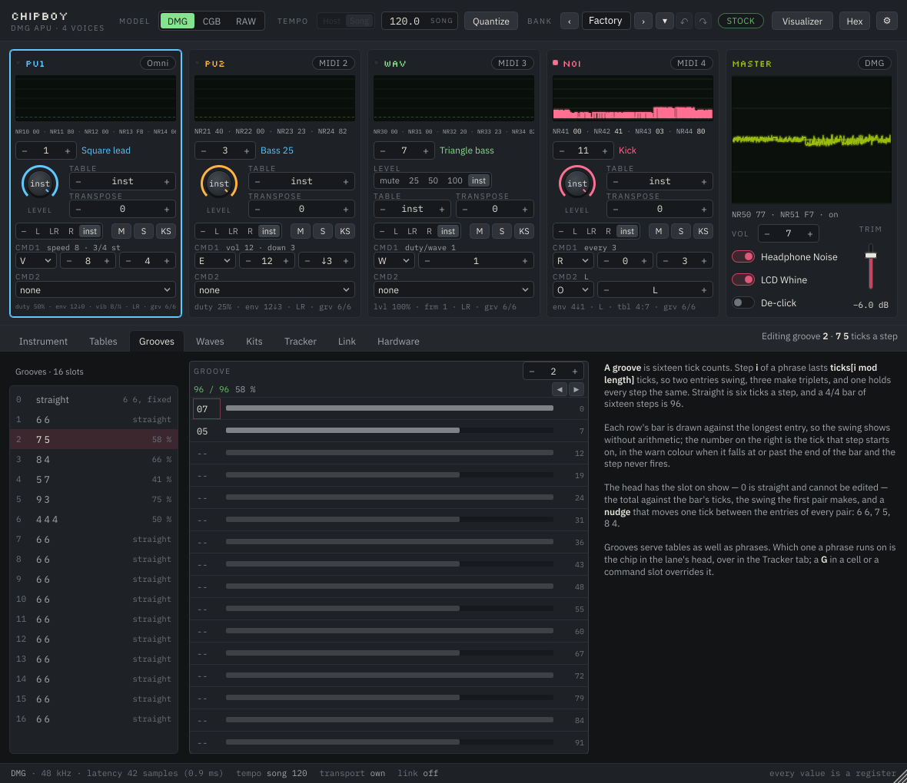

# ChipBoy — interface and feature design

Working document for the UI workshop. The spec (`CHIPBOY_SPEC.md` §11–§13) already fixes
the two-plugin architecture, the parameter rules and the bank; this document turns those
into screens, decides what the musician sees first, and records where the workshop
changes the spec. The interactive mockup is `docs/mockups/chipboy_mockup.html`.

Everything here follows one rule from the spec: **the chip is the instrument.** Every
control is a register or a driver choice, shown in the chip's own ranges, and the
interface's job is to make the constraints legible rather than to hide them.

---

## 1. Two plugins, one machine

**ChipBoy** is the machine: the APU, the bank, the analog stage, the stereo output. One
instance is one Game Boy — four mono voices that share a mixer, one coupling capacitor
per side, and the wave channel's rules (C1, C9).

**ChipBoy Voice** is a remote control for one of those four voices, living on its own
track so it gets its own piano roll, automation lanes, name and colour. It is an
instrument that outputs silence and says so (spec §11.6).

Each of the four hardware channels has a **source**:

| Source | What it means | When to use it |
|---|---|---|
| **MIDI channel 1–16** on the ChipBoy track | Notes on that MIDI channel play this voice | One track drives the whole machine: FL's per-pattern MIDI channel, Reaper's item channel, Logic's multi-timbral tracks |
| **Omni** | Every note reaching the ChipBoy track plays this voice | The first minute: drop it on a track and play |
| **Voice plugin** | A ChipBoy Voice on another track has claimed the channel | The DAW-native layout: one track per voice, automation where you expect it |
| **Off** | The channel only responds to the tracker lane and tables | Sound design, or a channel used purely as a drum from the lane |

Defaults: PU1 = omni, PU2 = MIDI 2, WAV = MIDI 3, NOI = MIDI 4. So a fresh instance plays
the lead the moment you touch a key, and the other three wake up when you address them.
A Voice claim overrides the MIDI source for that channel and the strip says which track
now owns it.

This is the design you described, made concrete. The alternatives were weighed:

- *Four independent plugins, one per channel, each with its own APU.* Breaks the shared
  mixer and coupling that make four channels sound like one machine (C1, C9). Rejected.
- *One multi-timbral plugin only, no helper.* Works in every host but piles four
  channels' automation onto one track. That is exactly the tracker-to-DAW friction this
  product exists to remove. Kept as the MIDI-channel source, not as the only way.
- *A MIDI-effect helper instead of a silent instrument.* Hosts route MIDI effects
  inconsistently; every host can put an instrument on a track. Rejected (spec §11.6).

---

## 2. The main window

1180 wide like a hardware unit, 1020 tall at minimum, at 100% — with 125% and 150%
scaling, which multiplies both. The width never changes; the height stretches, so the
corner resizer only moves vertically and every pixel it adds goes to the editor pane
(the bank lists and the Hardware tab get the room). 1020 is header 54 + mixer row 370
+ tab bar 34 + a 536 editor pane (512 and its padding) + status line 26, and it fits a
1080p screen with the host's own chrome. 512 is what the tracker lane's sixteen steps
need under its head, and it is the ceiling the Instrument tab is laid out against: its
four cards, two to a row, ask 474 at their tallest (§6, which does the arithmetic). The
chosen height is remembered with the project, as the scale is. Reading order is top to
bottom: *what am I emulating → what is each voice doing → edit the thing I selected.*

1. **Header.** Wordmark; the **model switch** (DMG / CGB / RAW); the **tempo group** —
   source (Host / Song), the **tempo in force** as a readout, and the *Quantize* toggle
   (§4); the bank name with previous/next; a **STOCK / MODIFIED** badge (§5); the
   visualizer window button; settings. The tempo is read only here — "120.0" with a
   small *host* or *song* tag, drawn as a well so nothing invites a drag: the host's BPM
   in Host mode, the active song's tempo in force in Song mode
   ([`COMMANDS_AND_TEMPO.md`](COMMANDS_AND_TEMPO.md) §19). A song's own master tempo is
   typed in the Tracker tab beside its *Start* and *Beats*, because it belongs to the
   song and the window holds several. The **Bank group is the active song's bank**: its
   name, the arrows and the menu — *Load bank into this song…*, *Save this song's
   bank…*, *Reset this song's bank to factory* — all act on the song in the active tab
   (§18). The badge beside it stays the window's: it reads the hardware departures,
   which §18 keeps global.
2. **The mixer row.** Four channel strips and a master strip. Every strip has its scope on
   top, mixer-bridge style, so the row reads at a glance while playing.
3. **Editor tabs.** Instrument · Tables · Grooves · Waves · Kits · Tracker · Link ·
   Hardware. The editor always knows its context: *Editing PU2's instrument "Bass 07"*.
4. **Status line.** Model, sample rate, latency, tick source, who owns the transport,
   link state — and, on the right, what the last file or preset did, for twenty seconds,
   in place of the tagline.

### A channel strip

Top to bottom: name and colour (PU1 sky, PU2 amber, WAV mint, NOI rose), an activity LED,
the source badge (*MIDI 2* / *Voice: Bass* / *Omni*); the scope; the live register line
(`NR11 80 · NR12 A3 · NR13 C1 · NR14 C7`) — the thing that teaches the instrument, kept
on screen deliberately (spec §13.1); instrument and table selectors; pan as the hardware
has it (off / L / both / R); two or three quick controls that differ by channel type
(level and envelope rate for PU and NOI; the four-step volume and frame for WAV); mute
and solo, which are NR51 gates and therefore pop like the hardware.

### The master strip

The stereo mix scope in LCD green; the live **NR50 / NR51** line; one **VOL** stepper,
0–7, where 0 reads "1/8" and not "mute"; the three switches — **Headphone Noise**,
**LCD Whine**, **De-click**; and the **output trim**, the one continuous control in the
product, drawn as a fader with a dB readout so nobody mistakes it for part of the chip.

One VOL writes both NR50 sides ([`COMMANDS_AND_TEMPO.md`](COMMANDS_AND_TEMPO.md) §21).
The two parameters stay — the `M` command and existing automation address left and
right — so the control writes them together as **one undo step**, shows the left value,
and, when something has moved them apart, shows both (`7·5`) with the tooltip saying
which is which. Headphone Noise is the hiss and the frame hum; **LCD Whine** is the
display's 9198 Hz line, an independent switch, so a unit with a quiet display is a
switch rather than a compromise. De-click is a departure and lights the header's
MODIFIED badge; the Hardware tab keeps the same three rows with the measured facts.

### 2.1 Editing conventions

Every control in both windows obeys the same three rules, so nothing has to be learned
twice.

**Every number is typeable.** A stepper's readout is a text field: click it (or press
Enter on it) and type. A knob or the trim fader opens the same small box on a double
click. **Enter** commits, **Escape** cancels, and moving the focus away commits, as a
name field does. What is accepted is digits, a leading minus where the range goes below
zero, and hex digits while *Hex* is on — anything else is **refused**, and the field
keeps what it had rather than guessing. A number inside the range is taken as typed; one
outside it is clamped to the range, because the range is the hardware's and there is
nothing else to do with 300 in a 0–15 field. Steppers also take digits typed straight
at them, the grids' convention, and a knob with Alt on the double click goes back to its
default. Segmented rows and switches stay click-only: they are a choice, not a number.
Command arguments are the exception to the base: they are base 10 by definition
(spec §9.6) and stay decimal in hex display.

**The wheel never edits.** It scrolls whatever is under it — a tab's pane, a bank list,
the chain's bars — and nothing else. A wheel that changed values meant that scrolling
past a knob silently retuned an instrument, and a trackpad made it worse; the gestures
that remain are the drag, the arrows, the +/− buttons and typing. This holds for
steppers, knobs, the fader, the combo boxes, every grid cell and both windows.

**Undo and redo cover every hand edit.** ↶ and ↷ in the header, **Ctrl+Z**,
**Ctrl+Shift+Z** and **Ctrl+Y** (Command on macOS) — except while a text box has the
keys, where Ctrl+Z belongs to the text. The buttons' tooltips name what they would take
back ("Undo: PU1 Instrument 3 → 5", "Undo: Tracker: PU2 bar 3 step 5") and the status
line says what happened. What is on the history: parameters moved from the interface,
bank edits, song edits (cells, chain, grooves, arms, step counts), preset and song-file
loads, the bank's name. What is not, and never opens a transaction: host automation, a
state restore — loading a project clears the history — a Voice plugin's edits, which
belong to the Voice's own history, and anything the audio thread does. One gesture is
one undo: a knob drag, a stepper held down and the digits of one typed value each
collapse into a single step.

**Command cells are two parts.** The letter is chosen, the values are typed. Clicking
the **letter** (the first glyph of the cell, drawn against its own hairline) opens a
palette of the letters this channel can carry, each with its name and what its arguments
mean, plus *none* and the letter's revert form; typing a letter key does the same. The
**values** are typed as numbers and validated against that letter's ranges: a digit the
letter cannot take is refused and the cell shows what it had. Changing the letter keeps
the values, clamped into the new letter's ranges — an empty cell instead takes the
letter's own defaults, so one keystroke still writes a command that does something.

**Right-click lists.** A right click on an **INS** cell lists the bank's instruments by
slot and name — only the slots in use, the ones this channel plays first and the rest
marked with their type — and picks one into the cell. The same on a **TBL** cell for
tables, and on a chain cell for the phrases the song uses, with how many bars play each.
The left click still selects the cell for typing.

---

## 3. The scopes

The wave viewer is the feature people will recognise from chiptune videos, and ChipBoy
can do it better than a video tool because it does not have to guess the period: the
APU knows it. Each channel's scope is **period-locked from the chip's own frequency
register**, so a sustained note is a still picture and vibrato is visible as the shape
breathing rather than as the trace sliding.

- **Two traces, selectable per scope:** *Digital* is the 4-bit staircase going into the
  DAC, on a 16-level grid; *Analog* is what leaves the machine after the coupling
  capacitor, so a low wave-channel note visibly sags on a DMG and turns into spikes on a
  CGB, and DAC-on clicks show as the steps they are. Both can be shown together.
- **Zoom:** 1, 2, 4 or 8 periods. Noise uses a fixed time window, and so does a kit —
  a kit is a sample, not a repeating wave, so there is no period to lock to.

**How the picture is held still.** A channel's staircase repeats *exactly* every
`32 × (2048 − f)` cycles (`64 ×` on the wave channel), so two windows of the same length
that start on the same **phase** of it draw the same trace whichever period they fall
in. "Start on the last rising edge before the window" is not that phase: a pulse has one
rising edge in a period and so picks the same one every frame, but a wave has up to
sixteen, and which of them was last before a window whose end moves with the audio
thread is effectively random — the trace jumped by a fraction of a period every frame,
which is what the flashing was. So the edge is chosen by what the waveform **is**, not
by where the search began: every rising edge of one whole period is a candidate, and the
one that **rises furthest** wins — ties go to the one whose level was held longest
before it (an apex and a trough repeat a sample, and the trace carries only changes, so
a trough's rise is held longest), then to the one that rises from the lowest level.
Those are properties of the shape, so they name the same phase every frame and survive
the window sliding; when the shape changes — a new note, a new wave — the next frame
picks the new shape's edge and the picture re-locks at once, and under vibrato the
period moves and the window with it while the edge stays the same one, so the shape
breathes rather than sliding. A waveform that ties on all three keys has two identical
halves, and starting on either draws the same picture. Nothing is remembered between
frames: the paint is a pure function of the samples the timer snapshotted, so two paints
of one snapshot are one picture. With less history in the ring than the window asks for
— a low note that has only just started — the search moves up to what there is and the
window keeps its length, so the picture is aligned and simply runs out on the right.
`chipboy_uishot --scope-check` holds a note on every channel and renders each scope
twice, a fifth of a second apart, comparing the two pixel for pixel
([`COMMANDS_AND_TEMPO.md`](COMMANDS_AND_TEMPO.md) §22).
- **The master scope** shows the actual output, with the clicks and the droop.
- **Visualizer window.** A separate, resizable, clean window — the four scopes stacked
  or tiled, plus the master, no chrome, adjustable line weight, black or LCD ground,
  and the analog, digital or both traces (analog by default) — made for screen capture. Same data, so it costs nothing extra to render.

---

## 4. Playing it from a DAW

Notes come from the piano roll. Everything the note carries maps to something the chip
can do, and nothing is smoothed (C6):

| MIDI | Effect | Range |
|---|---|---|
| Note on/off | Trigger / note-off behaviour of the instrument (kill, release, ignore) | pitch quantised to the 11-bit period (C4) |
| Velocity | Envelope start volume (default), or instrument bank select, or ignored — per channel | 0–15 |
| Pitch bend | Signed period offset, recomputed per tick | raw period units |
| Mod wheel (CC1) | Vibrato depth | 0–15 |
| Keyswitch octave (optional) | Instrument select | 12 slots per octave |
| Any CC | Learnable to any channel parameter | the parameter's own range |

**Latch on note-on** (spec §10.1) is what makes a piano roll behave like a tracker's note
columns: automate *Instrument* on the track, play notes against it, and each note takes
the instrument that was current when it started. *Live follow*, per channel, flips that
for sweeps meant to be heard.

**The lane set** ([`COMMANDS_AND_TEMPO.md`](COMMANDS_AND_TEMPO.md) §3, which supersedes
spec §12.4) appears on the Voice's track, or on the ChipBoy track when the channel is
MIDI-sourced. It is the tracker row and nothing else:

| Lane | What it is |
|---|---|
| Source | Omni / MIDI 1–16 / Off — the main plugin only |
| Instrument | 0 none, or 1–128; latched at note-on, or live |
| Table | 0 the instrument's, or 1–64 |
| Level | 0–15 or the instrument's (PU, NOI); mute / 25 / 50 / 100 % or the instrument's (WAV) |
| Pan | off / L / R / both / the instrument's |
| Transpose | −60…+60 semitones |
| CMD1 type, x, y | a letter and two arguments, 0–255 each |
| CMD2 type, x, y | the same |
| Live follow | Instrument, Table, Level, Pan and Transpose apply now instead of at the next note |
| Velocity | start volume / instrument bank / ignored |
| Keyswitches | on/off; the octave 24–35 (pulse) or 12–23 (wave, noise) selects slots 1–12 |

Every one is discrete and the host draws them as steps. It is short on purpose: the
instrument holds the sound, and the two **command slots** hold the performance. A slot is
a letter with two base-10 arguments — `W` duty or wave, `E` envelope, `V` vibrato, `A`
table, `F` frame, `T` tempo, and the rest of LSDj's set — and it is *in force*: it fires
at the next tick when the letter, `x` or `y` changes, and again at every note-on after
the instrument and its table, so a letter drawn across a bar shapes every note in it.
Setting the letter to *none* reverts what it changed to the instrument's value. There are
no lanes for duty, envelope, sweep, wave, frame, vibrato, arpeggio, detune or LFSR width
any more: those were the lanes that silently overrode the instrument, and their absence is
the point.

**Tempo** (§4 of the same document), in the header bar so it is in force wherever you
are. Ticks are always 24 to the beat. *Tempo source* is **Host** — ticks on multiples of
1/24 of the host's beat, exact under scrubbing — or **Song**, where the plugin keeps its
own *Song tempo* (40–255 BPM) with `T` commands over it and the host's bars are only a
ruler; the BPM stepper is greyed in Host mode. *Quantize*, off by default, holds note-ons
and note-offs until the next tick; bends and controllers are never quantized.

---

## 5. Models and the Hardware panel

The header switch chooses which real machine is emulated:

| | Chip | Output stage |
|---|---|---|
| **DMG** | DMG quirks: wave RAM locked while playing, trigger corruption, DAC hold | measured DMG coupling (25 Hz), noise floor, clip |
| **CGB** | CGB quirks: live wave RAM, no corruption | measured CGB coupling (338 Hz), its louder LCD whine |
| **RAW** | DMG chip | **none** — the clean digital mix most gaming emulators produce: DAC-off is silence, no coupling, no noise, no clicks from DC |

RAW is the "unemulated" mode you asked for. It is what a listener who learned these
sounds from an emulator expects, and it is deliberately the third position rather than a
pile of toggles.

The **Hardware** tab holds everything else, in two groups that the badge in the header
summarises:

**Hardware states** — legal on a real unit, so the badge stays STOCK:

| Control | Hardware fact |
|---|---|
| Headphone Noise on/off | The original switch: hiss, LCD line and frame hum together |
| LCD on/off | With the display off a DMG's 9198 Hz line drops 24 dB (measured). "Disable the whine" is this |
| CGB bass mod | The common capacitor swap. Corner scales with the capacitor: stock 338 Hz, ×10 → 34 Hz, ×47 → 7 Hz. Approximation, no modded unit measured |
| Volume writes at edges | A driver technique: NRx2 writes wait for the low half of the pulse cycle, where a level change is silent. "Don't pop when changing volumes", done the way a driver could |
| Pro Sound tap (later) | Output taken before the amplifier and volume pot |

**Departures** — not what any Game Boy does; switching one on lights **MODIFIED**:

| Control | What it does |
|---|---|
| Tame DAC clicks | Crossfades DAC-on steps over 0.5–5 ms instead of stepping |
| Soften master pops | Ramps NR50 changes instead of stepping the DC offset |

This revises constraint **C8** ("exactly one switch changes what you hear"). The spirit
survives: the defaults are a stock machine; every departure is opt-in, labelled as a
departure, and visible in the header of the instance that uses it.

**Display** options live in the same tab: decimal or hex values (the LSDj habit), scope
trace mode, periods shown.

---

## 6. LSDj parity

Everything LSDj can express about a sound, ChipBoy can express — with base-10 values,
the hardware's ranges, and none of the cartridge limits (C10).

- **Instruments** (spec §9.2–9.3): Pulse, Wave, Kit, Noise, with every field LSDj has —
  envelope, duty and duty sequence, sweep, length, vibrato, transpose, table, pan,
  note-off behaviour — plus the pitch fields of
  [`COMMANDS_AND_TEMPO.md`](COMMANDS_AND_TEMPO.md) §7 and the wave's frame advance and
  loop mode. The editor shows the field groups for the selected type and the register
  each field lands in, as four cards laid two to a row — Sound beside Envelope, Pitch &
  modulation beside Table & note behaviour — so the whole instrument is on screen at the
  window's smallest size. Switching the type keeps every field: each type reads the ones
  it uses, and switching back finds the rest as they were.

  | Card | Fields |
  |---|---|
  | **Sound** | what the type's registers are: duty, duty sequence and sweep (pulse); wave, frame advance, frame loop, volume (wave); kit, loop, rate (kit); LFSR width, pitch, clock shift, divisor, noise sweep (noise) — and **pan**, which is NR51 and belongs with them |
  | **Envelope** | volume, direction, rate and the one-second picture; pulse and noise only |
  | **Pitch & modulation** | **vibrato** shape and direction in one cell, then speed, depth and delay; **pitch speed** — Fast / Tick / Step / Drum, absent on noise, with Drum greyed on kits because a kit plays it as Fast; **command rate** |
  | **Table & note behaviour** | table, **table mode**, transpose, note-off, **overlap**, length |

  The fields whose value means something other than its number say so where the hint
  goes, and the hint changes as the value does: the vibrato speed reads "4 Hz" (Fast,
  Step, Drum) or "8 cycles/4 beats" (Tick), its depth "3/4 st" from LSDj's semitone
  table — "off" at 0, which is what the driver does with it — the pitch speed "360 Hz",
  "per tick", "P jumps" or "semitones", the command rate "every 3 ticks", the table mode
  "row per tick" or "row per note", and overlap "only the pitch" or "starts it again".
  The whole sentence for each is the control's tooltip, per option where the options
  differ.

  **The row arithmetic.** The pane is 512 tall and 1156 wide; the slot list takes 220 and
  a 14 px gap, so the cards have 922. A row is two cards: the left one 530 wide (three
  158 px field columns) and the right one 380 (two of 170). A field is a 16 px caption
  over its control — 38 with a segmented, 40 with a stepper, 86 with a knob — and fields
  flow into the columns, wrapping when the next one does not fit; a card adds 12 padding,
  a 22 px heading and 12 more. The tab is then the 26 px name row, a 12 px gap, the first
  card row, another 12, and the second. Wave and kit have no Envelope card, so their
  first row is Sound beside Pitch & modulation and Table & note behaviour has the second
  to itself:

  | | Pulse | Wave | Kit | Noise |
  |---|---|---|---|---|
  | first row | 236 | 282 | 282 | 230 |
  | second row | 188 | 138 | 138 | 188 |
  | **total** | **474** | **470** | **470** | **468** |

  Before the pitch fields joined the cards it was 510 / 468 / 468 / 510. The three new
  cells are paid for in the second row: the vibrato's shape and direction share one cell
  now, its delay is a stepper where it was a knob (40 px against 86), and pan went to the
  Sound card, which had a spare row where the two-column card next to it did not. A pulse
  instrument's second row is 188 where it was 230.

  **An instrument is a file too.** Under *Assign*, *New* and *Dup* sit **Save preset…**
  and **Load preset…**, which write and read a `.cbi` in `Documents/ChipBoy/Instruments`
  ([`COMMANDS_AND_TEMPO.md`](COMMANDS_AND_TEMPO.md) §15). A preset is the instrument with
  everything it references, transitively: its table, the tables that table's `A` commands
  start, the wave a wave instrument plays and the wave slots its tables' `W` commands
  select, and a kit instrument's kit. Loading puts it in the selected slot; each
  dependency takes the first free slot of its kind unless the bank already holds an
  identical one, and every reference is renumbered to match. The status bar says what
  went where — *"Pluck → slot 3; table 5 → 9 (renumbered); wave 2 reused"* — and a load
  that would overflow a kind fails without touching the bank. The two buttons take the
  row under the other three because two 110 px buttons do not fit beside them in the
  220 px list column.
- **Tables** (spec §9.5): 16 steps of volume, transpose, two commands; loop, hop, or
  stop at the end; one step per tick; shared by every instrument that references them.
- **Commands** (spec §9.6, LSDj lettering; [`COMMANDS_AND_TEMPO.md`](COMMANDS_AND_TEMPO.md)
  §2 has every letter's arguments): `A` table, `C` chord, `D` delay, `E` envelope, `F`
  frame, `G` groove, `H` hop (tables only), `K` kill, `L` slide, `O` pan, `P` bend
  speed, `R` retrigger, `S` sweep/shift, `T` tempo, `V` vibrato, `W` wave. Added by this
  workshop: `M` master volume L/R (NR50, hardware-legal) and `Z`, which re-runs the
  last command with a random argument; the rest are LSDj's own. The 2026-09-08 addendum
  (§7) refines `L`, `P`, `Z`, `R`, `M`, `C` and `E`.
- **Waves** (spec §9.7): 32 × 16 grid, up to 16 frames per wave, shape generators,
  interpolate between frames. The editor states the DMG cost of a frame change.
- **Kits** (spec §9.8): up to 32 one-shots, note map, playback rate quantised to the
  period register, one-shot / loop / loop-from-point, the 4-bit preview.
- **LSDj import** stays post-v1 (spec §15), but the data model is shaped so a `.sav`'s
  instruments, tables, waves and kits map one to one.

---

## 7. The Tracker tab — a tracker that follows the host, or runs itself

LSDj expresses most of its character through the tracker screen: a note, an instrument
and commands on a step. ChipBoy has that screen. It is a tracker with the DAW as its
transport — or with its own, when no DAW offers one — and it is the part of the product
that can later leave the DAW entirely (§10, D10).

Per channel: a **note** column, **vel**, **instrument**, **table** and two **command**
columns. A bar holds as many steps as its step count says, one to sixty-four
([`COMMANDS_AND_TEMPO.md`](COMMANDS_AND_TEMPO.md) §11): *Steps / bar* is a typed number
for the song, and a single bar may take one of its own in the chain's **STP** column.
Phrases are chained along the timeline by bar, with a groove (6/6, 7/5, 8/4 ticks per
step…) per phrase for swing. Cells fire at their step's tick; a cell's two commands are
applied once, there, and the persistent letters then hold until the next plain note
reloads the instrument (§12) — the lane and the automation lanes are one mechanism, not
two. **Vel** is the note's velocity, 1–127, blank meaning the default 100; a recorded
note keeps the velocity it arrived with, and every column takes the same gestures —
typed digits, + and −, Backspace to blank (§2.1: the wheel scrolls the pane, it never
edits). A right click on **ins** or **tbl** lists the bank's slots by name.

A command cell is drawn as the two things it is (§2.1): the **letter**, in the accent
colour against a hairline, then its **values**. The letter is picked from the palette a
click on it opens — filtered to the letters this channel can carry — or by typing it;
the values are typed and refused when they fall outside what that letter takes.

A command cell can also hold a letter's **revert form**, which is what the recorder
writes when an automation slot goes back to *none*: it puts that letter back where the
instrument left it and leaves nothing in force
([`COMMANDS_AND_TEMPO.md`](COMMANDS_AND_TEMPO.md) §9.4). It is drawn as the letter and an
equals sign — **`E =`** — and `=` is the key that enters it, on a cell that already has
a letter; typing a value again clears it. Three glyphs sit comfortably in the 53 px
command column, which holds seven (`V 15,15`), and `=` cannot be misread as an argument
the way a lone dot could; it is ASCII, so it draws in the embedded fonts whatever the
platform. The cost is that `=` no longer doubles for `+` in a command column, where `+`
still steps the argument.

**The chain stands beside the lane, rotated**: bars down, channels across. One row per
bar, numbered 1, 2, 3… at the left with the lowest at the top, four cells for the
channels' phrase slots and a fifth, **STP**, for that bar's own step count — blank means
the song's *Steps / bar*, and it is typed and blanked exactly as a phrase cell is. Its
rows keep the lane's 22 px rhythm, so bar 3's row sits beside step 3 of the lane; it
scrolls with the song, follows the playing bar, and grows the song by a bar when
something is typed in the empty row under the last one. Rotating it is what the step
count made necessary: a bar is now a row with a length of its own, and reading lengths
down a column is how a tracker reads.

**Per channel, in the lane's head**: a **record arm** — a red dot, on for a new song,
saved with it — then the channel's name, the caption **PLAYS** and the switch that says
what the channel plays: **MIDI**, the notes arriving from the host, shown greyed in the
note column as the bar plays; **Trkr**, its own cells, with incoming MIDI ignored
([`COMMANDS_AND_TEMPO.md`](COMMANDS_AND_TEMPO.md) §14); or **Hyb**, both at once — the
notes come from MIDI and everything else from the cells at their steps, the instrument
and table they select and their commands, fired once on whatever is sounding (§20). A
song can mix all three — lead from the piano roll, drums from the tracker, a bass whose
piano-roll notes take the song's commands. A Hybrid channel shows the roll's note greyed
in the note column, as a MIDI channel does, since its cells' notes and OFFs are ignored;
its **strip** carries a **HYBRID** tag beside the channel name and greys its Instrument,
Table and both command slots, which the driver does not read there — the slots say *from
the cells* where the resolved command reads, and every one of the four says the same
thing in its tooltip: *the tracker's cells drive this channel*. Level, Pan, Transpose and
the Velocity mode still apply.

The phrase's **groove chip** closes the row; the groove itself is edited in the Grooves
tab (§7.1). The third choice in PLAYS costs the chip about 30 px of a 236 px channel
group, so it says as much as fits — the slot and its ticks (`2·7/5`) where there is room,
the ticks alone at the demo's width, the slot number when a narrower window leaves only
a chip — and the whole of it is in the tooltip and in the menu the chip opens.

**The transport.** *Play*, *Stop* and *Loop* run the song when the plugin owns the
transport — the Standalone, or a host that offers no play head — from the song start on
the plugin's own clock at the Song tempo; *Loop* takes the whole song, bar 1 to its last
bar. In a host the host's transport rules: the buttons mirror it and are disabled, and
the header's *Tempo source* is fixed on **Song** while the plugin owns the transport,
with the tooltip saying why ([`COMMANDS_AND_TEMPO.md`](COMMANDS_AND_TEMPO.md) §16). The
status bar says which of the two is running: *transport own* or *transport host*.

**Record.** With the transport running and **Rec** on, the MIDI arriving on an **armed**
channel is written into its cells with the parameter values in force at each step —
whatever that channel plays, so an overdub onto a Trkr channel is audible while it is
recorded. An unarmed channel never records. That is how a piano-roll performance,
automation included, becomes a self-contained tracker song — the form a playback ROM
will need (§10). Recording captures what the driver actually did, so nothing is lost in
translation.

**Songs are tabs.** The strip under the head is one tab per loaded song
([`COMMANDS_AND_TEMPO.md`](COMMANDS_AND_TEMPO.md) §18): its name, a dot while it has
unsaved work, an **×** that closes it — asking first when that dot is there — and a **+**
that starts an empty song on the factory bank. Clicking a tab makes it the **active**
one, and only the active tab is live: it is what plays and records, what the Instrument,
Tables, Grooves, Waves and Kits tabs show and edit, and whose bank the header's Bank
group names. Every one of those tabs reads the song and the bank through the same two
accessors, so a switch redraws all of them; `chipboy_uishot --tab-switch` checks exactly
that, by marking one tab's bank and song and shooting the five panes on either side of a
switch. The window keeps at least one song open.

**Songs are files.** *Save song…* writes the active tab — chains, phrases, grooves, the
steps and the bar overrides, its master tempo, song start, beats per bar, playback
sources and arms, **and the bank it plays through** — as a `.cbsong` in
`Documents/ChipBoy/Songs`, beside the banks folder; a tab that came from a file writes
back to it, and one that has none opens a chooser and takes its name. *Load song…* opens
a file in a **tab of its own**, unless the active tab is a fresh untitled song with
nothing to lose, in which case the song lands there. A file that carries its own bank
(format 5) is complete and brings its sounds with it; an older one takes a copy of the
active tab's bank and the status line says where that bank differs — *"Opened ChipBoy
Demo — written with bank Factory, 11 instruments used. slot 7 was Triangle bass; this
bank has Organ"*. What a file did goes to the status bar, where every other file message
goes; the tab strip stands where that line used to.

**Numbers.** At the minimum window height the tab has 1156 × 512 and asks for no
scrolling: a 112 px head over 400 px of lane, which is a 48 px head and sixteen 22 px
rows. The head is **two rows of grouped tools under their captions, then the tab strip**
([`COMMANDS_AND_TEMPO.md`](COMMANDS_AND_TEMPO.md) §23): a 12 px caption line over a 26 px
control row, 4 px, the same again, 6 px, and the 26 px strip where the summary line
stood — 112 exactly, the same budget as before. Row one is **TRANSPORT** (*Play* 62,
*Stop* 62, *Loop* 52, then the LED, *playing* and the bar . beat . sixteenth readout,
328 in all) and **RECORD** (*Rec*, 62); row two is **SONG** (*Tempo* 84 — the song's
master tempo, typed — *Start* 84, *Beats* 62, *Steps / bar* 80, each behind its own small
caption, 562 in all) and **FILE** (*Save song…* 104, *Load song…* 104, *Export .gb* 96).
A 16 px gap with a hairline down the middle of it stands between the two groups of a row,
so the head reads as four things and not as eleven controls. Across, the chain
takes 164 px off the right with a 12 px gap, leaving 980 for the lane: a 34 px step
column and four channel groups of 236, each a 39 px note, 31 vel, 31 ins, 29 tbl and two
53 px commands. The chain's own 164 is a 25 px gutter for the bar number and five 25 px
cells 2 px apart, under a 48 px head that lines up with the lane's. **Past sixteen
steps** the lane is taller than its pane and scrolls inside it — the tab's only
scrollbar — following the cursor as it is typed down the bar and the row the selected
channel is playing; a bar of 64 steps is 1456 px of lane. The playing row is highlighted
per channel on the step that channel's own groove is really playing, not on a sixteenth
of the bar, so a swung phrase marks the row that is sounding; the position readout beside
the transport stays bar . beat . sixteenth, which is the clock and not the groove.

*The demo song opened from `Demo/ChipBoy Demo.cbsong` into a tab of its own — the strip
under the head holds it beside the empty song the plugin starts with — playing on the
plugin's own transport: four channels of cells with their velocities, the arms lit beside
each name, the three-way PLAYS switch in each head, and the chain on the right with the
playing bar marked.*

**The clock is 24 ticks to the beat** and a straight step is six of them, as LSDj. Which
tempo is in force — *Tempo source*, the tempo readout and *Quantize* — is the header's
group, so it is one thing wherever you are working; this tab keeps what belongs to the
song: its master *Tempo*, its *Start* on the host's timeline and its *Beats* per bar.
*Start* is greyed in Host mode and live whenever the plugin owns the transport, where the
source is Song by definition; *Beats* is live in **both** modes, because the host
contributes the tempo and never its time signature, so the song's bar is this many beats
either way ([`COMMANDS_AND_TEMPO.md`](COMMANDS_AND_TEMPO.md) §11 as amended, §19).
The status bar says which tempo is in force — "tempo host 120" or "tempo song 150".
In Song mode the position at any host time is the integral of the song's own tempo map — the base tempo plus its `T` cells at known ticks —
so a jump to bar 9 lands on the step playing through would have reached, and a playback
ROM could reproduce it. Automating the *Song tempo* parameter (or holding a `T` in an
automation slot) is the approximate form: the plugin integrates while playing and
re-anchors on a locate with the value it sees there. See
[`COMMANDS_AND_TEMPO.md`](COMMANDS_AND_TEMPO.md) §4.

Three doors still lead to the driver, and they coexist: automation and CC lanes for
sweeps; note-embedded data (velocity, keyswitches, pitch bend, note-off); and the lane
for per-step commands. Whichever wrote the register last wins at the tick.

### 7.1 The Grooves tab

A groove is sixteen tick counts, each 1–48 with 0 unused, and step *i* of a phrase lasts
`ticks[i mod length]` — so two entries swing, three make triplets
([`COMMANDS_AND_TEMPO.md`](COMMANDS_AND_TEMPO.md) §9.2). Grooves serve **tables** as well
as phrases, so they have a tab of their own rather than a corner of the lane; the lane
keeps the chip that says which groove a phrase runs on.

The song's sixteen slots are listed on the left, as the bank lists are: the slot number,
its ticks — *7 5*, *4 4 4*, *6 6* — and, on the right of the row, the swing its first
pair makes or the word *straight*. A seventeenth row above them is groove **0**, which is
straight and cannot be edited. Selecting a row shows it in the editor, and the stepper in
the editor's head browses the same selection, so the two never disagree. The tab opens on
the lowest slot that is not straight — slot 1 of a fresh song is 6 6 and shows nothing —
and while a channel plays it follows the groove in force for the selected channel, as the
editor did beside the lane, until the list or the stepper browses elsewhere.

The editor is the sixteen cells in a column. Each row shows its count, a bar drawn
against the longest entry so the swing is visible without arithmetic, and the tick that
step starts on — in the warn colour when that start falls at or past the end of the bar,
where the step does not fire at all. Rows past the groove's length are blank and repeat
it. The head carries the slot being browsed, the **total** against the bar's ticks —
green when they match, warn when the groove over- or under-fills the bar — the **swing**
the first pair makes (61 % for 8/5, 50 % for 6/6), and a **◀ ▶ nudge** that moves one
tick between the entries of every pair, keeping each pair's total: 6 6 → 7 5 → 8 4, and
back. A cell takes the lane's gestures and a value drag as well: a vertical drag, + and
−, two typed digits, Backspace to end the groove there; ← and → are the nudge. The
wheel scrolls the tab (§2.1). One drag, or one typed value, is one undo. While the transport runs, the row the selected channel is really playing is
marked — but only while the editor is showing the groove that channel is running on.

**Numbers.** The pane's 1156 × 512: the list 220 wide with a 14 px gap, the editor 520,
and the 382 that are left explain what a groove is. The editor has the room the lane
could not give it, so its rows grow with the pane — (512 − 48) ⁄ 16 = 29 px at the
minimum height, against 22 in the old corner — and its bar track is 426 px against 70.

*The song's grooves with their ticks and the swing each makes, and slot 2 — 7 5, 58 %,
filling the bar exactly at 96 ticks — in the editor. The two entries repeat down the
sixteen steps, so the rows past them are blank and their bars are drawn dimmer.*

---

## 8. The Voice plugin window

Small, because it lives beside a piano roll: 560 × 420.

- Link status at the top — *Linked · ChipBoy 1 · PU2*, or *waiting* / *channel busy* /
  *disconnected* in plain words — with instance and channel selectors.
- One line that answers the question everyone asks: **audio comes out of the ChipBoy 1
  track.**
- Its channel's scope, fed by the return path (display only, never audio — C9).
- Instrument selector with the **Linked / Local** source switch and explicit *push to
  slot* / *pull from slot* (spec §12.5).
- The channel's parameters as a compact grid — the same automation lanes the host shows.
- *Open editor* jumps the main window to this channel's instrument. Editing happens in
  one place, the bank, so a change is heard everywhere the instrument is used.

---

## 9. Standalone

The main plugin as an application: MIDI input selector in the header, everything else
identical. For jamming, for testing hardware captures against the model, and for people
who want a Game Boy on a keyboard without a DAW.

---

## 10. Decisions taken (2026-09-07)

| # | Question | Outcome |
|---|---|---|
| D-UI-1 | A lane of commands only, or a full tracker? | **Full tracker** with a note column and a record arm (§7), so a song can later be exported as a `.gb` playback ROM (spec §15.3, post-v1) |
| D-UI-2 | What RAW is | **DMG chip, analog stage bypassed** — ideal squares, the 32-step wave staircase, no sag, no DC, no noise (§5) |
| D-UI-3 | Ship the departures in v1? | **Yes**, and de-click gets a switch on the master strip as well as in the Hardware tab |
| D-UI-4 | Default routing | **As mocked**: PU1 omni, PU2 / WAV / NOI on MIDI 2–4 |
| D-UI-5 | Keyswitches on by default? | **Off**; one click enables them and the strip shows the reserved octave (§4 explains what they are) |
| D-UI-6 | Visualizer window in v1? | **Yes** — and everything in the mockup ships in v1 |

Spec §6.5, §9.6, §12.3, §13, §15.3, §17, §18 and constraint C8 carry these; the change is
recorded in `CHANGES.md`.
